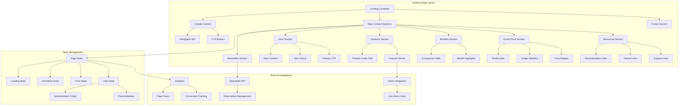
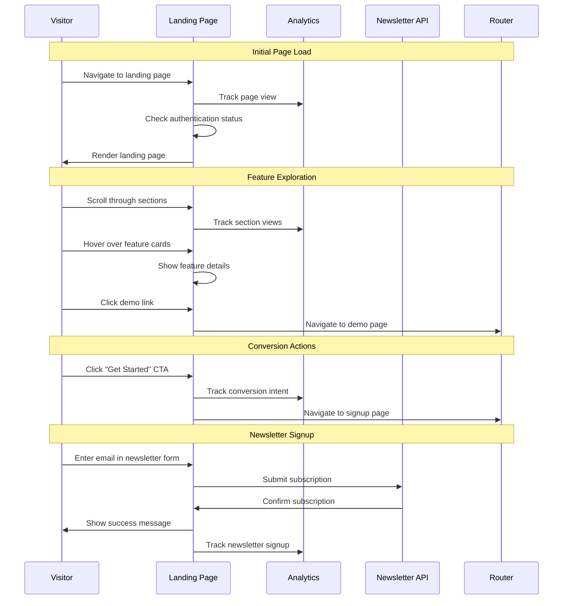

# Landing Page Design

## Overview

The landing page for Arguschain will serve as a premium, enterprise-grade marketing and conversion entry point that establishes the platform as the leading blockchain analysis solution. The design emphasizes sophisticated professionalism through premium visual design, enterprise-focused messaging, and seamless user experience. The page will showcase technical excellence while appealing to enterprise decision-makers, developers, researchers, and analysts through carefully crafted content hierarchy and professional polish.

## Architecture

### Component Architecture



### Page Flow Architecture



## Components and Interfaces

### Core Components

#### 1. Landing Page Container

```typescript
// pages/Landing.tsx
import { useEffect, useState } from "react";
import { useSession } from "@/lib/auth/auth-client";
import { Navbar } from "@/components/layout/Navbar";
import { Footer } from "@/components/layout/Footer";
import { HeroSection } from "@/components/landing/HeroSection";
import { FeaturesSection } from "@/components/landing/FeaturesSection";
import { BenefitsSection } from "@/components/landing/BenefitsSection";
import { SocialProofSection } from "@/components/landing/SocialProofSection";
import { ResourcesSection } from "@/components/landing/ResourcesSection";
import { NewsletterSection } from "@/components/landing/NewsletterSection";

export default function Landing() {
  const { data: session } = useSession();
  const [isLoaded, setIsLoaded] = useState(false);

  useEffect(() => {
    // Track page view
    if (typeof window !== 'undefined' && window.gtag) {
      window.gtag('event', 'page_view', {
        page_title: 'Arguschain - Blockchain Analysis Platform',
        page_location: window.location.href,
      });
    }

    setIsLoaded(true);
  }, []);

  return (
    <div className="bg-bg-dark-primary text-text-primary min-h-screen overflow-x-hidden">
      <header className="fixed top-0 left-0 w-full z-[10000] border-b border-border-color bg-[rgba(25,28,40,0.9)] backdrop-blur-[10px]">
        <Navbar />
      </header>

      <main className="pt-20">
        <HeroSection user={session?.user} isLoaded={isLoaded} />
        <FeaturesSection />
        <BenefitsSection />
        <SocialProofSection />
        <ResourcesSection />
        <NewsletterSection />
      </main>

      <Footer />
    </div>
  );
}
```

#### 2. Hero Section Component

```typescript
// components/landing/HeroSection.tsx
import { useState, useEffect } from "react";
import { Link } from "react-router-dom";
import { Button } from "@/components/global";
import { ArrowRight, Play, Zap } from "lucide-react";

interface HeroSectionProps {
  user?: {
    id: string;
    name?: string;
    email: string;
  } | null;
  isLoaded: boolean;
}

export function HeroSection({ user, isLoaded }: HeroSectionProps) {
  const [animationPhase, setAnimationPhase] = useState(0);

  useEffect(() => {
    if (isLoaded) {
      const timer1 = setTimeout(() => setAnimationPhase(1), 200);
      const timer2 = setTimeout(() => setAnimationPhase(2), 600);
      const timer3 = setTimeout(() => setAnimationPhase(3), 1000);

      return () => {
        clearTimeout(timer1);
        clearTimeout(timer2);
        clearTimeout(timer3);
      };
    }
  }, [isLoaded]);

  return (
    <section className="relative min-h-screen flex items-center justify-center bg-gradient-to-br from-bg-dark-primary via-bg-dark-secondary to-bg-dark-primary overflow-hidden">
      {/* Background Effects */}
      <div className="absolute inset-0 bg-[radial-gradient(circle_at_30%_20%,rgba(0,191,255,0.1),transparent_50%)]" />
      <div className="absolute inset-0 bg-[radial-gradient(circle_at_70%_80%,rgba(0,191,255,0.05),transparent_50%)]" />

      {/* Animated Grid Background */}
      <div className="absolute inset-0 bg-[linear-gradient(rgba(0,191,255,0.03)_1px,transparent_1px),linear-gradient(90deg,rgba(0,191,255,0.03)_1px,transparent_1px)] bg-[size:50px_50px] animate-pulse" />

      <div className="relative z-10 max-w-7xl mx-auto px-6 text-center">
        <div className="space-y-8">
          {/* Main Headline */}
          <div className={`transition-all duration-1000 ${animationPhase >= 1 ? 'opacity-100 translate-y-0' : 'opacity-0 translate-y-8'}`}>
            <h1 className="text-4xl md:text-6xl lg:text-7xl font-bold text-white mb-6 leading-tight">
              <span className="text-accent-primary">Advanced</span> Blockchain
              <br />
              <span className="bg-gradient-to-r from-accent-primary to-blue-400 bg-clip-text text-transparent">
                Analysis Platform
              </span>
            </h1>
          </div>

          {/* Subtitle */}
          <div className={`transition-all duration-1000 delay-300 ${animationPhase >= 2 ? 'opacity-100 translate-y-0' : 'opacity-0 translate-y-8'}`}>
            <p className="text-xl md:text-2xl text-text-secondary max-w-4xl mx-auto leading-relaxed">
              Unlock the power of blockchain with enterprise-grade transaction debugging,
              trace analysis, and smart contract insights. Built for developers, researchers, and analysts.
            </p>
          </div>

          {/* Key Benefits */}
          <div className={`transition-all duration-1000 delay-500 ${animationPhase >= 2 ? 'opacity-100 translate-y-0' : 'opacity-0 translate-y-8'}`}>
            <div className="flex flex-wrap justify-center gap-6 text-sm md:text-base">
              <div className="flex items-center space-x-2 text-accent-primary">
                <Zap className="h-5 w-5" />
                <span>Real-time Analysis</span>
              </div>
              <div className="flex items-center space-x-2 text-accent-primary">
                <Zap className="h-5 w-5" />
                <span>Enterprise Security</span>
              </div>
              <div className="flex items-center space-x-2 text-accent-primary">
                <Zap className="h-5 w-5" />
                <span>Developer-Friendly APIs</span>
              </div>
            </div>
          </div>

          {/* Call to Action Buttons */}
          <div className={`transition-all duration-1000 delay-700 ${animationPhase >= 3 ? 'opacity-100 translate-y-0' : 'opacity-0 translate-y-8'}`}>
            <div className="flex flex-col sm:flex-row gap-4 justify-center items-center">
              {user ? (
                <Link to="/">
                  <Button size="lg" className="px-8 py-4 text-lg">
                    Go to Dashboard
                    <ArrowRight className="ml-2 h-5 w-5" />
                  </Button>
                </Link>
              ) : (
                <>
                  <Link to="/signin">
                    <Button size="lg" className="px-8 py-4 text-lg">
                      Get Started Free
                      <ArrowRight className="ml-2 h-5 w-5" />
                    </Button>
                  </Link>
                  <Link to="/debug-trace">
                    <Button variant="outline" size="lg" className="px-8 py-4 text-lg">
                      <Play className="mr-2 h-5 w-5" />
                      Try Live Demo
                    </Button>
                  </Link>
                </>
              )}
            </div>
          </div>

          {/* Trust Indicators */}
          <div className={`transition-all duration-1000 delay-900 ${animationPhase >= 3 ? 'opacity-100' : 'opacity-0'}`}>
            <div className="flex flex-wrap justify-center items-center gap-8 mt-12 text-text-secondary">
              <div className="text-center">
                <div className="text-2xl font-bold text-accent-primary">10K+</div>
                <div className="text-sm">Transactions Analyzed</div>
              </div>
              <div className="text-center">
                <div className="text-2xl font-bold text-accent-primary">99.9%</div>
                <div className="text-sm">Uptime</div>
              </div>
              <div className="text-center">
                <div className="text-2xl font-bold text-accent-primary">500+</div>
                <div className="text-sm">Developers</div>
              </div>
            </div>
          </div>
        </div>
      </div>

      {/* Scroll Indicator */}
      <div className="absolute bottom-8 left-1/2 transform -translate-x-1/2 animate-bounce">
        <div className="w-6 h-10 border-2 border-accent-primary rounded-full flex justify-center">
          <div className="w-1 h-3 bg-accent-primary rounded-full mt-2 animate-pulse" />
        </div>
      </div>
    </section>
  );
}
```

#### 3. Features Section Component

```typescript
// components/landing/FeaturesSection.tsx
import { useState } from "react";
import { Link } from "react-router-dom";
import { Card } from "@/components/global";
import { Button } from "@/components/global";
import {
  Search,
  Activity,
  Database,
  FileText,
  Network,
  Zap,
  ArrowRight
} from "lucide-react";

interface Feature {
  id: string;
  title: string;
  description: string;
  icon: React.ComponentType<{ className?: string }>;
  demoLink: string;
  benefits: string[];
  color: string;
}

const features: Feature[] = [
  {
    id: "debug-transaction",
    title: "Transaction Debugging",
    description: "Deep dive into transaction execution with detailed traces, gas analysis, and error detection.",
    icon: Search,
    demoLink: "/debug-trace",
    benefits: ["Step-by-step execution traces", "Gas optimization insights", "Error root cause analysis"],
    color: "from-blue-500/20 to-blue-600/20 border-blue-500/30",
  },
  {
    id: "trace-analysis",
    title: "Call Trace Analysis",
    description: "Visualize complex call hierarchies and understand smart contract interactions.",
    icon: Activity,
    demoLink: "/trace-transaction",
    benefits: ["Interactive call trees", "Contract interaction mapping", "Performance bottleneck identification"],
    color: "from-green-500/20 to-green-600/20 border-green-500/30",
  },
  {
    id: "block-exploration",
    title: "Block Explorer",
    description: "Comprehensive block analysis with transaction grouping and statistical insights.",
    icon: Database,
    demoLink: "/trace-block",
    benefits: ["Block-level analytics", "Transaction clustering", "Network health monitoring"],
    color: "from-purple-500/20 to-purple-600/20 border-purple-500/30",
  },
  {
    id: "storage-analysis",
    title: "Storage Analysis",
    description: "Examine contract storage changes and state transitions across transactions.",
    icon: FileText,
    demoLink: "/storage-analysis",
    benefits: ["State change tracking", "Storage slot analysis", "Historical state queries"],
    color: "from-orange-500/20 to-orange-600/20 border-orange-500/30",
  },
  {
    id: "network-monitoring",
    title: "Network Monitoring",
    description: "Real-time network status, gas prices, and mempool analysis.",
    icon: Network,
    demoLink: "/network-monitor",
    benefits: ["Real-time gas tracking", "Mempool insights", "Network congestion analysis"],
    color: "from-cyan-500/20 to-cyan-600/20 border-cyan-500/30",
  },
  {
    id: "performance-analytics",
    title: "Performance Analytics",
    description: "Advanced metrics and performance insights for smart contract optimization.",
    icon: Zap,
    demoLink: "/performance-dashboard",
    benefits: ["Performance benchmarking", "Optimization recommendations", "Cost analysis"],
    color: "from-yellow-500/20 to-yellow-600/20 border-yellow-500/30",
  },
];

export function FeaturesSection() {
  const [hoveredFeature, setHoveredFeature] = useState<string | null>(null);

  return (
    <section className="py-24 bg-bg-dark-secondary relative">
      <div className="max-w-7xl mx-auto px-6">
        {/* Section Header */}
        <div className="text-center mb-16">
          <h2 className="text-3xl md:text-5xl font-bold text-white mb-6">
            Powerful Analysis Tools
          </h2>
          <p className="text-xl text-text-secondary max-w-3xl mx-auto">
            Everything you need to understand, debug, and optimize blockchain transactions and smart contracts.
          </p>
        </div>

        {/* Features Grid */}
        <div className="grid grid-cols-1 md:grid-cols-2 lg:grid-cols-3 gap-8">
          {features.map((feature) => (
            <Card
              key={feature.id}
              className={`p-8 bg-gradient-to-br ${feature.color} backdrop-blur-sm border hover:shadow-xl transition-all duration-300 group cursor-pointer`}
              onMouseEnter={() => setHoveredFeature(feature.id)}
              onMouseLeave={() => setHoveredFeature(null)}
            >
              <div className="space-y-6">
                {/* Icon and Title */}
                <div className="flex items-start space-x-4">
                  <div className="flex-shrink-0">
                    <feature.icon className="h-10 w-10 text-accent-primary group-hover:scale-110 transition-transform duration-300" />
                  </div>
                  <div className="flex-1">
                    <h3 className="text-xl font-semibold text-white mb-2 group-hover:text-accent-primary transition-colors">
                      {feature.title}
                    </h3>
                    <p className="text-text-secondary text-sm leading-relaxed">
                      {feature.description}
                    </p>
                  </div>
                </div>

                {/* Benefits List */}
                <div className={`space-y-2 transition-all duration-300 ${
                  hoveredFeature === feature.id ? 'opacity-100 max-h-40' : 'opacity-70 max-h-0 overflow-hidden'
                }`}>
                  {feature.benefits.map((benefit, index) => (
                    <div key={index} className="flex items-center space-x-2 text-sm">
                      <div className="w-1.5 h-1.5 bg-accent-primary rounded-full flex-shrink-0" />
                      <span className="text-text-secondary">{benefit}</span>
                    </div>
                  ))}
                </div>

                {/* Demo Link */}
                <Link to={feature.demoLink}>
                  <Button
                    variant="outline"
                    size="sm"
                    className="w-full group-hover:bg-accent-primary group-hover:text-bg-dark-primary group-hover:border-accent-primary transition-all duration-300"
                  >
                    Try Demo
                    <ArrowRight className="ml-2 h-4 w-4 group-hover:translate-x-1 transition-transform duration-300" />
                  </Button>
                </Link>
              </div>
            </Card>
          ))}
        </div>

        {/* Bottom CTA */}
        <div className="text-center mt-16">
          <Link to="/signin">
            <Button size="lg" className="px-8 py-4">
              Start Analyzing Now
              <ArrowRight className="ml-2 h-5 w-5" />
            </Button>
          </Link>
        </div>
      </div>
    </section>
  );
}
```

#### 4. Benefits Section Component

```typescript
// components/landing/BenefitsSection.tsx
import { Card } from "@/components/global";
import {
  Shield,
  Zap,
  Code,
  BarChart3,
  Clock,
  Users
} from "lucide-react";

interface Benefit {
  icon: React.ComponentType<{ className?: string }>;
  title: string;
  description: string;
  metric?: string;
}

const benefits: Benefit[] = [
  {
    icon: Shield,
    title: "Enterprise Security",
    description: "Bank-grade security with SOC 2 compliance, encrypted data transmission, and secure API access.",
    metric: "99.9% Uptime",
  },
  {
    icon: Zap,
    title: "Lightning Fast",
    description: "Optimized for speed with advanced caching, parallel processing, and real-time analysis.",
    metric: "<100ms Response",
  },
  {
    icon: Code,
    title: "Developer First",
    description: "Comprehensive APIs, SDKs, and documentation designed by developers, for developers.",
    metric: "RESTful APIs",
  },
  {
    icon: BarChart3,
    title: "Advanced Analytics",
    description: "Deep insights with statistical analysis, pattern recognition, and predictive modeling.",
    metric: "50+ Metrics",
  },
  {
    icon: Clock,
    title: "Real-time Processing",
    description: "Live transaction monitoring, instant alerts, and real-time network status updates.",
    metric: "Live Updates",
  },
  {
    icon: Users,
    title: "Team Collaboration",
    description: "Share analyses, collaborate on investigations, and manage team access with role-based permissions.",
    metric: "Multi-user",
  },
];

export function BenefitsSection() {
  return (
    <section className="py-24 bg-bg-dark-primary relative">
      {/* Background Pattern */}
      <div className="absolute inset-0 bg-[radial-gradient(circle_at_50%_50%,rgba(0,191,255,0.05),transparent_70%)]" />

      <div className="relative max-w-7xl mx-auto px-6">
        {/* Section Header */}
        <div className="text-center mb-16">
          <h2 className="text-3xl md:text-5xl font-bold text-white mb-6">
            Why Choose Arguschain?
          </h2>
          <p className="text-xl text-text-secondary max-w-3xl mx-auto">
            Built for the demands of professional blockchain analysis with enterprise-grade features and performance.
          </p>
        </div>

        {/* Benefits Grid */}
        <div className="grid grid-cols-1 md:grid-cols-2 lg:grid-cols-3 gap-8">
          {benefits.map((benefit, index) => (
            <Card
              key={index}
              className="p-8 bg-card-bg backdrop-blur-sm border border-border-color hover:border-accent-primary/50 transition-all duration-300 group"
            >
              <div className="space-y-4">
                {/* Icon */}
                <div className="flex items-center justify-between">
                  <benefit.icon className="h-12 w-12 text-accent-primary group-hover:scale-110 transition-transform duration-300" />
                  {benefit.metric && (
                    <span className="text-sm font-mono text-accent-primary bg-accent-primary/10 px-3 py-1 rounded-full">
                      {benefit.metric}
                    </span>
                  )}
                </div>

                {/* Content */}
                <div>
                  <h3 className="text-xl font-semibold text-white mb-3 group-hover:text-accent-primary transition-colors">
                    {benefit.title}
                  </h3>
                  <p className="text-text-secondary leading-relaxed">
                    {benefit.description}
                  </p>
                </div>
              </div>
            </Card>
          ))}
        </div>

        {/* Comparison Table */}
        <div className="mt-20">
          <div className="text-center mb-12">
            <h3 className="text-2xl md:text-3xl font-bold text-white mb-4">
              How We Compare
            </h3>
            <p className="text-text-secondary">
              See why leading teams choose Arguschain for their blockchain analysis needs.
            </p>
          </div>

          <div className="overflow-x-auto">
            <table className="w-full bg-card-bg backdrop-blur-sm border border-border-color rounded-lg">
              <thead>
                <tr className="border-b border-border-color">
                  <th className="text-left p-6 text-white font-semibold">Feature</th>
                  <th className="text-center p-6 text-accent-primary font-semibold">Arguschain</th>
                  <th className="text-center p-6 text-text-secondary font-semibold">Others</th>
                </tr>
              </thead>
              <tbody>
                <tr className="border-b border-border-color/50">
                  <td className="p-6 text-text-secondary">Real-time Analysis</td>
                  <td className="p-6 text-center text-green-400">✓</td>
                  <td className="p-6 text-center text-red-400">Limited</td>
                </tr>
                <tr className="border-b border-border-color/50">
                  <td className="p-6 text-text-secondary">API Access</td>
                  <td className="p-6 text-center text-green-400">Full REST API</td>
                  <td className="p-6 text-center text-yellow-400">Basic</td>
                </tr>
                <tr className="border-b border-border-color/50">
                  <td className="p-6 text-text-secondary">Team Collaboration</td>
                  <td className="p-6 text-center text-green-400">✓</td>
                  <td className="p-6 text-center text-red-400">✗</td>
                </tr>
                <tr className="border-b border-border-color/50">
                  <td className="p-6 text-text-secondary">Custom Integrations</td>
                  <td className="p-6 text-center text-green-400">✓</td>
                  <td className="p-6 text-center text-red-400">✗</td>
                </tr>
                <tr>
                  <td className="p-6 text-text-secondary">Enterprise Support</td>
                  <td className="p-6 text-center text-green-400">24/7</td>
                  <td className="p-6 text-center text-yellow-400">Business Hours</td>
                </tr>
              </tbody>
            </table>
          </div>
        </div>
      </div>
    </section>
  );
}
```

## Professional Design Standards

### Visual Design Principles

1. **Premium Typography**: Use sophisticated font pairings with proper hierarchy
   - Primary: Inter or similar modern sans-serif for headings
   - Secondary: System fonts for body text with optimal readability
   - Monospace: JetBrains Mono for code examples and technical content

2. **Enterprise Color Palette**:
   - Primary: Deep blues and sophisticated grays
   - Accent: Professional cyan/teal for highlights
   - Supporting: Subtle gradients and professional color combinations
   - Avoid: Overly bright or consumer-focused colors

3. **Spacing and Layout**:
   - Generous whitespace for premium feel
   - Consistent 8px grid system
   - Professional section spacing (80-120px between major sections)
   - Balanced content-to-whitespace ratio

4. **Professional Imagery**:
   - High-quality, enterprise-appropriate visuals
   - Subtle blockchain/technology themed graphics
   - Professional photography if using team/client images
   - Consistent visual style and quality

### Enterprise Credibility Elements

1. **Trust Indicators**:
   - Security certifications (SOC 2, ISO 27001)
   - Industry compliance badges
   - Enterprise client logos (with permission)
   - Professional awards or recognition

2. **Social Proof**:
   - Enterprise customer testimonials
   - Case studies with quantifiable results
   - Usage statistics and performance metrics
   - Industry analyst recognition

3. **Professional Content**:
   - Executive-level messaging
   - Technical depth without overwhelming
   - Clear value propositions for different audiences
   - Professional tone and language

### Enhanced Component Requirements

#### 5. Enterprise Section Component

```typescript
// components/landing/EnterpriseSection.tsx
import { Card } from "@/components/global";
import { Button } from "@/components/global";
import { Link } from "react-router-dom";
import {
  Building2,
  Shield,
  Users,
  Headphones,
  ArrowRight,
  CheckCircle
} from "lucide-react";

interface EnterpriseFeature {
  icon: React.ComponentType<{ className?: string }>;
  title: string;
  description: string;
  benefits: string[];
}

const enterpriseFeatures: EnterpriseFeature[] = [
  {
    icon: Building2,
    title: "Enterprise Deployment",
    description: "On-premise or private cloud deployment options with full data control.",
    benefits: ["Private cloud deployment", "On-premise installation", "Custom infrastructure", "Data sovereignty"],
  },
  {
    icon: Shield,
    title: "Advanced Security",
    description: "Enterprise-grade security with SOC 2 Type II compliance and audit trails.",
    benefits: ["SOC 2 Type II certified", "End-to-end encryption", "Audit logging", "Role-based access"],
  },
  {
    icon: Users,
    title: "Team Management",
    description: "Advanced user management with SSO integration and team collaboration tools.",
    benefits: ["SSO integration", "Team workspaces", "Permission management", "Activity tracking"],
  },
  {
    icon: Headphones,
    title: "Dedicated Support",
    description: "24/7 enterprise support with dedicated account management and SLA guarantees.",
    benefits: ["24/7 support", "Dedicated account manager", "SLA guarantees", "Priority response"],
  },
];

export function EnterpriseSection() {
  return (
    <section className="py-24 bg-gradient-to-br from-bg-dark-secondary to-bg-dark-primary relative">
      <div className="max-w-7xl mx-auto px-6">
        {/* Section Header */}
        <div className="text-center mb-16">
          <h2 className="text-3xl md:text-5xl font-bold text-white mb-6">
            Built for Enterprise
          </h2>
          <p className="text-xl text-text-secondary max-w-3xl mx-auto">
            Scalable, secure, and compliant blockchain analysis solutions designed for enterprise organizations.
          </p>
        </div>

        {/* Enterprise Features Grid */}
        <div className="grid grid-cols-1 md:grid-cols-2 gap-8 mb-16">
          {enterpriseFeatures.map((feature, index) => (
            <Card
              key={index}
              className="p-8 bg-card-bg backdrop-blur-sm border border-border-color hover:border-accent-primary/50 transition-all duration-300 group"
            >
              <div className="space-y-6">
                {/* Icon and Title */}
                <div className="flex items-start space-x-4">
                  <feature.icon className="h-12 w-12 text-accent-primary group-hover:scale-110 transition-transform duration-300 flex-shrink-0" />
                  <div>
                    <h3 className="text-xl font-semibold text-white mb-2 group-hover:text-accent-primary transition-colors">
                      {feature.title}
                    </h3>
                    <p className="text-text-secondary leading-relaxed">
                      {feature.description}
                    </p>
                  </div>
                </div>

                {/* Benefits List */}
                <div className="space-y-2">
                  {feature.benefits.map((benefit, benefitIndex) => (
                    <div key={benefitIndex} className="flex items-center space-x-3">
                      <CheckCircle className="h-4 w-4 text-green-400 flex-shrink-0" />
                      <span className="text-text-secondary text-sm">{benefit}</span>
                    </div>
                  ))}
                </div>
              </div>
            </Card>
          ))}
        </div>

        {/* Enterprise CTA */}
        <div className="text-center bg-gradient-to-r from-accent-primary/10 to-blue-500/10 rounded-2xl p-12 border border-accent-primary/20">
          <h3 className="text-2xl md:text-3xl font-bold text-white mb-4">
            Ready to Scale Your Blockchain Analysis?
          </h3>
          <p className="text-text-secondary mb-8 max-w-2xl mx-auto">
            Join leading enterprises who trust Arguschain for their mission-critical blockchain analysis needs.
          </p>
          <div className="flex flex-col sm:flex-row gap-4 justify-center">
            <Button size="lg" className="px-8 py-4">
              Request Enterprise Demo
              <ArrowRight className="ml-2 h-5 w-5" />
            </Button>
            <Button variant="outline" size="lg" className="px-8 py-4">
              Contact Sales Team
            </Button>
          </div>
        </div>
      </div>
    </section>
  );
}
```

#### 6. Technical Specifications Component

```typescript
// components/landing/TechnicalSection.tsx
import { Card } from "@/components/global";
import { Button } from "@/components/global";
import { Link } from "react-router-dom";
import {
  Code2,
  Database,
  Zap,
  Globe,
  ArrowRight,
  ExternalLink
} from "lucide-react";

interface TechnicalSpec {
  category: string;
  specs: {
    label: string;
    value: string;
  }[];
}

const technicalSpecs: TechnicalSpec[] = [
  {
    category: "Performance",
    specs: [
      { label: "Query Response Time", value: "<100ms" },
      { label: "Concurrent Users", value: "1000+" },
      { label: "Data Processing", value: "Real-time" },
      { label: "Uptime SLA", value: "99.9%" },
    ],
  },
  {
    category: "Integration",
    specs: [
      { label: "REST API", value: "Full Coverage" },
      { label: "WebSocket", value: "Real-time Events" },
      { label: "SDKs", value: "Multiple Languages" },
      { label: "Webhooks", value: "Custom Events" },
    ],
  },
  {
    category: "Networks",
    specs: [
      { label: "Ethereum Mainnet", value: "✓" },
      { label: "Testnets", value: "All Major" },
      { label: "Layer 2", value: "Polygon, Arbitrum" },
      { label: "Custom RPCs", value: "Supported" },
    ],
  },
  {
    category: "Security",
    specs: [
      { label: "Encryption", value: "AES-256" },
      { label: "Authentication", value: "OAuth 2.0" },
      { label: "Compliance", value: "SOC 2 Type II" },
      { label: "Data Retention", value: "Configurable" },
    ],
  },
];

export function TechnicalSection() {
  return (
    <section className="py-24 bg-bg-dark-primary relative">
      <div className="max-w-7xl mx-auto px-6">
        {/* Section Header */}
        <div className="text-center mb-16">
          <h2 className="text-3xl md:text-5xl font-bold text-white mb-6">
            Technical Specifications
          </h2>
          <p className="text-xl text-text-secondary max-w-3xl mx-auto">
            Built on enterprise-grade infrastructure with comprehensive APIs and developer-friendly integrations.
          </p>
        </div>

        {/* Technical Specs Grid */}
        <div className="grid grid-cols-1 md:grid-cols-2 lg:grid-cols-4 gap-8 mb-16">
          {technicalSpecs.map((category, index) => (
            <Card
              key={index}
              className="p-6 bg-card-bg backdrop-blur-sm border border-border-color hover:border-accent-primary/50 transition-all duration-300"
            >
              <h3 className="text-lg font-semibold text-white mb-4 border-b border-border-color pb-2">
                {category.category}
              </h3>
              <div className="space-y-3">
                {category.specs.map((spec, specIndex) => (
                  <div key={specIndex} className="flex justify-between items-center">
                    <span className="text-text-secondary text-sm">{spec.label}</span>
                    <span className="text-accent-primary text-sm font-mono">{spec.value}</span>
                  </div>
                ))}
              </div>
            </Card>
          ))}
        </div>

        {/* Developer Resources */}
        <div className="grid grid-cols-1 md:grid-cols-3 gap-8">
          <Card className="p-8 bg-gradient-to-br from-blue-500/10 to-blue-600/10 border border-blue-500/20">
            <Code2 className="h-12 w-12 text-blue-400 mb-4" />
            <h3 className="text-xl font-semibold text-white mb-3">API Documentation</h3>
            <p className="text-text-secondary mb-6">
              Comprehensive REST API documentation with interactive examples and SDKs.
            </p>
            <Link to="/docs/api">
              <Button variant="outline" size="sm" className="border-blue-400 text-blue-400 hover:bg-blue-400 hover:text-bg-dark-primary">
                View API Docs
                <ExternalLink className="ml-2 h-4 w-4" />
              </Button>
            </Link>
          </Card>

          <Card className="p-8 bg-gradient-to-br from-green-500/10 to-green-600/10 border border-green-500/20">
            <Database className="h-12 w-12 text-green-400 mb-4" />
            <h3 className="text-xl font-semibold text-white mb-3">Developer Sandbox</h3>
            <p className="text-text-secondary mb-6">
              Test our APIs in a sandbox environment with sample data and real-time examples.
            </p>
            <Link to="/sandbox">
              <Button variant="outline" size="sm" className="border-green-400 text-green-400 hover:bg-green-400 hover:text-bg-dark-primary">
                Try Sandbox
                <ArrowRight className="ml-2 h-4 w-4" />
              </Button>
            </Link>
          </Card>

          <Card className="p-8 bg-gradient-to-br from-purple-500/10 to-purple-600/10 border border-purple-500/20">
            <Globe className="h-12 w-12 text-purple-400 mb-4" />
            <h3 className="text-xl font-semibold text-white mb-3">Integration Guides</h3>
            <p className="text-text-secondary mb-6">
              Step-by-step guides for integrating Arguschain into your existing workflows.
            </p>
            <Link to="/docs/integrations">
              <Button variant="outline" size="sm" className="border-purple-400 text-purple-400 hover:bg-purple-400 hover:text-bg-dark-primary">
                View Guides
                <ExternalLink className="ml-2 h-4 w-4" />
              </Button>
            </Link>
          </Card>
        </div>
      </div>
    </section>
  );
}
```

## Data Models

### Enhanced Landing Page Analytics

```typescript
interface LandingPageAnalytics {
  pageViews: number;
  uniqueVisitors: number;
  conversionRate: number;
  sectionEngagement: {
    hero: number;
    features: number;
    benefits: number;
    socialProof: number;
    resources: number;
    newsletter: number;
    enterprise: number;
    technical: number;
  };
  ctaClicks: {
    getStarted: number;
    tryDemo: number;
    goToDashboard: number;
    requestDemo: number;
    contactSales: number;
  };
  demoLinkClicks: {
    [featureId: string]: number;
  };
  enterpriseEngagement: {
    caseStudyViews: number;
    pricingInquiries: number;
    enterpriseContactRequests: number;
  };
}

interface EnterpriseInquiry {
  id: string;
  companyName: string;
  contactEmail: string;
  contactName: string;
  companySize: "startup" | "small" | "medium" | "large" | "enterprise";
  useCase: string;
  timeline: string;
  budget?: string;
  requirements: string[];
  createdAt: Date;
  status: "new" | "contacted" | "demo_scheduled" | "proposal_sent" | "closed";
}
```

## Error Handling

### Professional Error States

1. **Graceful Degradation**: All sections should gracefully handle loading failures
2. **User-Friendly Messages**: Professional error messages that don't expose technical details
3. **Fallback Content**: Static content when dynamic content fails to load
4. **Retry Mechanisms**: Automatic retry for transient failures with exponential backoff

## Testing Strategy

### Professional Quality Assurance

1. **Visual Regression Testing**: Ensure consistent professional appearance across updates
2. **Performance Testing**: Validate loading times and Core Web Vitals
3. **Accessibility Testing**: Comprehensive WCAG 2.1 AA compliance validation
4. **Cross-browser Testing**: Ensure professional appearance across all major browsers
5. **Mobile Testing**: Validate professional mobile experience on various devices
6. **Enterprise User Testing**: Test with enterprise personas and use cases
