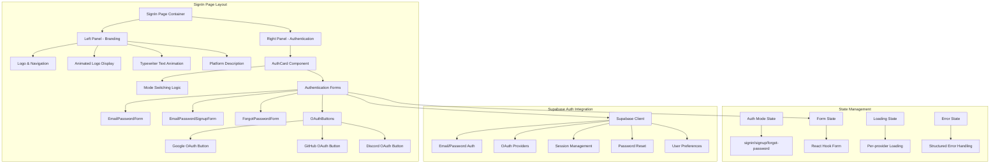
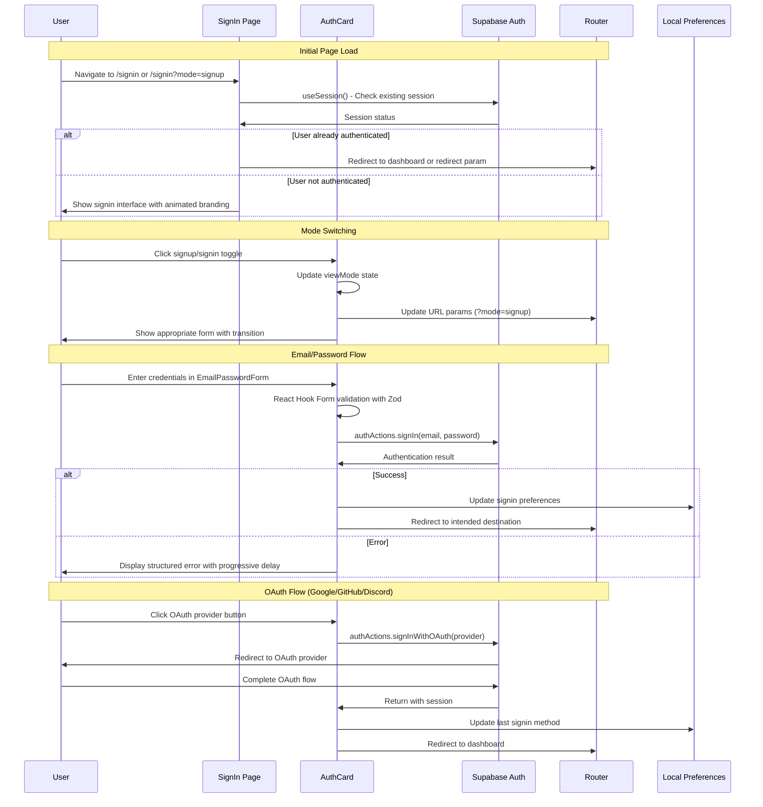

# Signin Page Design

## Overview

The signin page for Arguschain provides a professional, developer-focused authentication interface that integrates with Supabase Auth. The design features a split-screen layout with an animated left panel showcasing the platform's capabilities and a right panel containing the authentication forms. The implementation prioritizes user experience, accessibility, and security while maintaining consistency with the platform's blockchain analysis theme.

**Backend Integration:** This design integrates with Supabase Auth as configured in the `user-auth-setup` spec, providing OAuth providers (GitHub, Google, Discord), email/password authentication, and session management.

## Architecture

### Component Architecture



### Page Flow Architecture



## Components and Interfaces

### Core Components

#### 1. SignIn Page Container

```typescript
// pages/SignIn.tsx
import React, { useEffect, Suspense, useState } from "react";
import { useNavigate, useSearchParams, Link } from "react-router-dom";
import { useSession } from "@/lib/auth";
import { Logo, Loader, AnimatedTransactionHash } from "@/components/global";
import animatedLogoSvg from "@/assets/animated_logo.svg";

const AuthCard = React.lazy(() =>
  import("@/components/auth").then((module) => ({ default: module.AuthCard }))
);

function TypewriterText({ texts, speed = 100, delay = 2000 }) {
  // Typewriter animation implementation
  // ... (see actual implementation)
}

export default function SignIn() {
  const navigate = useNavigate();
  const [searchParams] = useSearchParams();
  const { session, loading: isLoading } = useSession();

  const initialMode = searchParams.get("mode") === "signup" ? "signup" : "signin";
  const [authMode, setAuthMode] = useState<"signin" | "signup">(initialMode);

  // Handle mode changes and URL updates
  const handleAuthModeChange = (mode: "signin" | "signup") => {
    setAuthMode(mode);
    // Update URL parameters
    const newSearchParams = new URLSearchParams(searchParams);
    if (mode === "signup") {
      newSearchParams.set("mode", "signup");
    } else {
      newSearchParams.delete("mode");
    }
    navigate(`/signin${newSearchParams.toString() ? `?${newSearchParams.toString()}` : ""}`, { replace: true });
  };

  // Redirect authenticated users
  useEffect(() => {
    if (session?.user && !isLoading) {
      const redirectTo = searchParams.get("redirect") || "/";
      navigate(redirectTo, { replace: true });
    }
  }, [session, isLoading, navigate, searchParams]);

  return (
    <div className="min-h-screen bg-bg-dark-primary text-text-primary flex">
      {/* Left Panel - Branding */}
      <div className="hidden lg:flex flex-1 relative bg-gradient-to-br from-bg-dark-secondary to-bg-dark-primary">
        <div className="flex-1 flex flex-col justify-center items-center p-12">
          <div className="w-full max-w-3xl mb-6 flex justify-center">
            <div className="relative">
              <AnimatedTransactionHash />
              
            </div>
          </div>
          <div className="space-y-6 max-w-3xl text-center">
            <h2 className="font-space text-3xl font-semibold text-text-primary">
              <TypewriterText
                texts={[
                  "Analyzing Ethereum Transactions...",
                  "Debugging Smart Contracts...",
                  "Optimizing Gas Usage...",
                  "Tracing Transaction Flows...",
                  "Monitoring Blockchain Activity...",
                ]}
              />
            </h2>
            <p className="text-md text-text-secondary font-mono leading-relaxed">
              Enterprise-grade blockchain analysis platform for developers, auditors, and DeFi teams
            </p>
          </div>
        </div>
      </div>

      {/* Right Panel - Authentication */}
      <div className="flex-1 flex flex-col justify-center px-6 sm:px-8 lg:px-12 xl:px-16 max-w-md lg:max-w-lg xl:max-w-xl mx-auto lg:mx-0 py-8 pt-20">
        <div className="absolute top-6 left-6">
          <Link to="/" className="flex items-center gap-3 hover:opacity-80 transition-opacity">
            <Logo className="h-6 w-auto" />
            <span className="text-xl text-[#00bfff] tracking-wide font-audiowide">arguschain</span>
          </Link>
        </div>

        <div className="w-full max-w-sm mx-auto lg:mx-0">
          <div className="mb-4 space-y-1">
            <h1 className="font-space text-2xl font-bold text-[#00bfff] tracking-tight">
              {authMode === "signin" ? "Welcome back" : "Get started"}
            </h1>
          </div>

          <Suspense fallback={<Loader />}>
            <div className="animate-fade-in">
              <AuthCard mode={authMode} onModeChange={handleAuthModeChange} />
            </div>
          </Suspense>
        </div>
      </div>
    </div>
  );
}
```

#### 2. AuthCard Component

```typescript
// components/auth/AuthCard.tsx
import { useState, useRef, useEffect } from "react";
import { Card } from "@/components/global";
import { EmailPasswordForm } from "./EmailPasswordForm";
import { EmailPasswordSignupForm } from "./EmailPasswordSignupForm";
import OAuthButtons from "./OAuthButtons";
import { ForgotPasswordForm } from "./ForgotPasswordForm";

type ViewMode = "signin" | "signup" | "forgot-password";

interface AuthCardProps {
  mode: "signin" | "signup";
  onModeChange: (mode: "signin" | "signup") => void;
}

export function AuthCard({ mode, onModeChange }: AuthCardProps) {
  const [viewMode, setViewMode] = useState<ViewMode>(mode);
  const cardRef = useRef<HTMLDivElement>(null);

  // Sync with parent mode changes
  useEffect(() => {
    setViewMode(mode);
  }, [mode]);

  const handleViewModeChange = (newMode: ViewMode) => {
    setViewMode(newMode);

    // Update parent for signin/signup modes
    if (newMode === "signin" || newMode === "signup") {
      onModeChange(newMode);
    }

    // Focus management for accessibility
    setTimeout(() => {
      if (cardRef.current) {
        const firstFocusableElement = cardRef.current.querySelector(
          'input, button, [tabindex]:not([tabindex="-1"])'
        ) as HTMLElement;
        if (firstFocusableElement) {
          firstFocusableElement.focus();
        }
      }
    }, 100);
  };

  // Keyboard navigation support
  useEffect(() => {
    const handleKeyDown = (event: KeyboardEvent) => {
      if (event.key === "Escape" && viewMode === "forgot-password") {
        handleViewModeChange("signin");
      }
    };

    document.addEventListener("keydown", handleKeyDown);
    return () => document.removeEventListener("keydown", handleKeyDown);
  }, [viewMode]);

  const getTitle = () => {
    switch (viewMode) {
      case "signin": return "Sign in to your account to continue";
      case "signup": return "Create your account to get started";
      case "forgot-password": return "Reset your password";
      default: return "";
    }
  };

  return (
    <div ref={cardRef} role="main" aria-labelledby="auth-title">
      <Card className="p-6 bg-bg-dark-secondary border-border-color shadow-lg transition-all duration-300 hover:shadow-xl backdrop-blur-sm">
        <div className="text-center mb-6">
          <p id="auth-title" className="text-text-secondary text-xs">
            {getTitle()}
          </p>
        </div>

        <div className="space-y-5 min-h-[350px] relative">
          <div className="transition-all duration-500 ease-in-out">
            {viewMode === "signin" && (
              <div className="space-y-5 opacity-100 transform translate-x-0 transition-all duration-500 animate-in slide-in-from-right-2">
                <OAuthButtons />

                <div className="relative" role="separator">
                  <div className="absolute inset-0 flex items-center">
                    <span className="w-full border-t border-border-color" />
                  </div>
                  <div className="relative flex justify-center text-xs uppercase">
                    <span className="bg-bg-dark-secondary px-2 text-text-secondary">Or</span>
                  </div>
                </div>

                <EmailPasswordForm onForgotPassword={() => handleViewModeChange("forgot-password")} />

                <div className="text-center">
                  <p className="text-sm text-text-secondary">
                    Don't have an account?{" "}
                    <button
                      onClick={() => handleViewModeChange("signup")}
                      className="text-accent-primary hover:text-text-secondary transition-colors cursor-pointer bg-transparent border-none underline"
                    >
                      Sign up
                    </button>
                  </p>
                </div>
              </div>
            )}

            {viewMode === "signup" && (
              <div className="space-y-5 opacity-100 transform translate-x-0 transition-all duration-500 animate-in slide-in-from-right-2">
                <OAuthButtons />

                <div className="relative" role="separator">
                  <div className="absolute inset-0 flex items-center">
                    <span className="w-full border-t border-border-color" />
                  </div>
                  <div className="relative flex justify-center text-xs uppercase">
                    <span className="bg-bg-dark-secondary px-2 text-text-secondary">Or</span>
                  </div>
                </div>

                <EmailPasswordSignupForm />

                <div className="text-center">
                  <p className="text-sm text-text-secondary">
                    Already have an account?{" "}
                    <button
                      onClick={() => handleViewModeChange("signin")}
                      className="text-accent-primary hover:text-text-secondary transition-colors cursor-pointer bg-transparent border-none underline"
                    >
                      Sign in
                    </button>
                  </p>
                </div>
              </div>
            )}

            {viewMode === "forgot-password" && (
              <div className="opacity-100 transform translate-x-0 transition-all duration-500 animate-in slide-in-from-left-2">
                <ForgotPasswordForm onBackToSignIn={() => handleViewModeChange("signin")} />
              </div>
            )}
          </div>
        </div>
      </Card>
    </div>
  );
}
```

#### 3. Email/Password Form Component

```typescript
// components/auth/EmailPasswordForm.tsx
import { useState } from "react";
import { useForm } from "react-hook-form";
import { zodResolver } from "@hookform/resolvers/zod";
import { z } from "zod";
import { signIn } from "@/lib/auth/auth-client";
import { handleAuthError } from "@/lib/auth/error-handler";
import { Button } from "@/components/global";
import { Input } from "@/components/global";
import { Label } from "@/components/global";
import { Alert } from "@/components/global";

const signinSchema = z.object({
  email: z.string().email("Please enter a valid email address"),
  password: z.string().min(1, "Password is required"),
});

type SigninFormData = z.infer<typeof signinSchema>;

export function EmailPasswordForm() {
  const [isLoading, setIsLoading] = useState(false);
  const [error, setError] = useState<string | null>(null);
  const [attemptCount, setAttemptCount] = useState(0);

  const {
    register,
    handleSubmit,
    formState: { errors },
  } = useForm<SigninFormData>({
    resolver: zodResolver(signinSchema),
  });

  const onSubmit = async (data: SigninFormData) => {
    setIsLoading(true);
    setError(null);

    // Implement progressive delays for failed attempts
    if (attemptCount > 0) {
      const delay = Math.min(1000 * Math.pow(2, attemptCount - 1), 8000);
      await new Promise(resolve => setTimeout(resolve, delay));
    }

    try {
      const { error: authError } = await signIn.email({
        email: data.email,
        password: data.password,
      });

      if (authError) {
        setError(handleAuthError(authError));
        setAttemptCount(prev => prev + 1);
        return;
      }

      // Success - navigation handled by parent component
    } catch (err) {
      setError(handleAuthError(err));
      setAttemptCount(prev => prev + 1);
    } finally {
      setIsLoading(false);
    }
  };

  return (
    <form onSubmit={handleSubmit(onSubmit)} className="space-y-4">
      {error && (
        <Alert variant="destructive" className="text-sm">
          {error}
        </Alert>
      )}

      <div className="space-y-2">
        <Label htmlFor="email">Email</Label>
        <Input
          id="email"
          type="email"
          autoComplete="email"
          placeholder="Enter your email"
          {...register("email")}
          className={errors.email ? "border-red-500" : ""}
          disabled={isLoading}
        />
        {errors.email && (
          <p className="text-red-500 text-xs" role="alert">
            {errors.email.message}
          </p>
        )}
      </div>

      <div className="space-y-2">
        <Label htmlFor="password">Password</Label>
        <Input
          id="password"
          type="password"
          autoComplete="current-password"
          placeholder="Enter your password"
          {...register("password")}
          className={errors.password ? "border-red-500" : ""}
          disabled={isLoading}
        />
        {errors.password && (
          <p className="text-red-500 text-xs" role="alert">
            {errors.password.message}
          </p>
        )}
      </div>

      <Button
        type="submit"
        className="w-full"
        disabled={isLoading}
        aria-describedby={error ? "signin-error" : undefined}
      >
        {isLoading ? "Signing in..." : "Sign In"}
      </Button>
    </form>
  );
}
```

#### 4. OAuth Buttons Component

```typescript
// components/auth/OAuthButtons.tsx
import React, { useState, useCallback, memo } from "react";
import { authActions, handleAuthError } from "@/lib/auth";
import { Button, Alert } from "@/components/global";
import { updateLastSigninMethod } from "@/lib/auth/signin-preferences";

// Custom icon components for OAuth providers
const GitHubIcon = ({ className }: { className?: string }) => (
  <svg className={className} viewBox="0 0 24 24" fill="currentColor" aria-hidden="true">
    <path d="M12 0c-6.626 0-12 5.373-12 12 0 5.302 3.438 9.8 8.207 11.387.599.111.793-.261.793-.577v-2.234c-3.338.726-4.033-1.416-4.033-1.416-.546-1.387-1.333-1.756-1.333-1.756-1.089-.745.083-.729.083-.729 1.205.084 1.839 1.237 1.839 1.237 1.07 1.834 2.807 1.304 3.492.997.107-.775.418-1.305.762-1.604-2.665-.305-5.467-1.334-5.467-5.931 0-1.311.469-2.381 1.236-3.221-.124-.303-.535-1.524.117-3.176 0 0 1.008-.322 3.301 1.23.957-.266 1.983-.399 3.003-.404 1.02.005 2.047.138 3.006.404 2.291-1.552 3.297-1.23 3.297-1.23.653 1.653.242 2.874.118 3.176.77.84 1.235 1.911 1.235 3.221 0 4.609-2.807 5.624-5.479 5.921.43.372.823 1.102.823 2.222v3.293c0 .319.192.694.801.576 4.765-1.589 8.199-6.086 8.199-11.386 0-6.627-5.373-12-12-12z" />
  </svg>
);

const DiscordIcon = ({ className }: { className?: string }) => (
  <svg className={className} viewBox="0 0 24 24" fill="currentColor" aria-hidden="true">
    <path d="M20.317 4.37a19.791 19.791 0 0 0-4.885-1.515a.074.074 0 0 0-.079.037c-.21.375-.444.864-.608 1.25a18.27 18.27 0 0 0-5.487 0a12.64 12.64 0 0 0-.617-1.25a.077.077 0 0 0-.079-.037A19.736 19.736 0 0 0 3.677 4.37a.07.07 0 0 0-.032.027C.533 9.046-.32 13.58.099 18.057a.082.082 0 0 0 .031.057a19.9 19.9 0 0 0 5.993 3.03a.078.078 0 0 0 .084-.028a14.09 14.09 0 0 0 1.226-1.994a.076.076 0 0 0-.041-.106a13.107 13.107 0 0 1-1.872-.892a.077.077 0 0 1-.008-.128a10.2 10.2 0 0 0 .372-.292a.074.074 0 0 1 .077-.01c3.928 1.793 8.18 1.793 12.062 0a.074.074 0 0 1 .078.01c.12.098.246.198.373.292a.077.077 0 0 1-.006.127a12.299 12.299 0 0 1-1.873.892a.077.077 0 0 0-.041.107c.36.698.772 1.362 1.225 1.993a.076.076 0 0 0 .084.028a19.839 19.839 0 0 0 6.002-3.03a.077.077 0 0 0 .032-.054c.5-5.177-.838-9.674-3.549-13.66a.061.061 0 0 0-.031-.03zM8.02 15.33c-1.183 0-2.157-1.085-2.157-2.419c0-1.333.956-2.419 2.157-2.419c1.21 0 2.176 1.096 2.157 2.42c0 1.333-.956 2.418-2.157 2.418zm7.975 0c-1.183 0-2.157-1.085-2.157-2.419c0-1.333.955-2.419 2.157-2.419c1.21 0 2.176 1.096 2.157 2.42c0 1.333-.946 2.418-2.157 2.418z" />
  </svg>
);

const GoogleIcon = ({ className }: { className?: string }) => (
  <svg className={className} viewBox="0 0 24 24" fill="none" aria-hidden="true">
    <path d="M22.56 12.25c0-.78-.07-1.53-.2-2.25H12v4.26h5.92c-.26 1.37-1.04 2.53-2.21 3.31v2.77h3.57c2.08-1.92 3.28-4.74 3.28-8.09z" fill="#4285F4"/>
    <path d="M12 23c2.97 0 5.46-.98 7.28-2.66l-3.57-2.77c-.98.66-2.23 1.06-3.71 1.06-2.86 0-5.29-1.93-6.16-4.53H2.18v2.84C3.99 20.53 7.7 23 12 23z" fill="#34A853"/>
    <path d="M5.84 14.09c-.22-.66-.35-1.36-.35-2.09s.13-1.43.35-2.09V7.07H2.18C1.43 8.55 1 10.22 1 12s.43 3.45 1.18 4.93l2.85-2.22.81-.62z" fill="#FBBC05"/>
    <path d="M12 5.38c1.62 0 3.06.56 4.21 1.64l3.15-3.15C17.45 2.09 14.97 1 12 1 7.7 1 3.99 3.47 2.18 7.07l3.66 2.84c.87-2.6 3.3-4.53 6.16-4.53z" fill="#EA4335"/>
  </svg>
);

function OAuthButtons() {
  const [isLoading, setIsLoading] = useState<string | null>(null);
  const [error, setError] = useState<string | null>(null);

  const handleOAuthSignIn = useCallback(async (provider: "github" | "discord" | "google") => {
    setIsLoading(provider);
    setError(null);

    try {
      const { error: authError } = await authActions.signInWithOAuth(provider);

      if (authError) {
        setError(handleAuthError(authError).message);
        return;
      }

      // Update user preferences on successful OAuth signin
      updateLastSigninMethod(provider);
    } catch (err) {
      setError(handleAuthError(err).message);
    } finally {
      setIsLoading(null);
    }
  }, []);

  return (
    <div className="space-y-3">
      {error && (
        <Alert variant="destructive" className="text-sm" role="alert">
          {error}
        </Alert>
      )}

      {/* Grid layout for three OAuth buttons */}
      <div className="grid grid-cols-3 gap-3">
        <Button
          type="button"
          variant="outline"
          onClick={() => handleOAuthSignIn("google")}
          disabled={isLoading !== null}
          className="w-full h-12 p-3 transition-all duration-300 hover:scale-[1.02] active:scale-[0.98] focus:ring-2 focus:ring-accent-primary focus:ring-offset-2 focus:ring-offset-bg-dark-secondary disabled:hover:scale-100"
          aria-label="Sign in with Google"
        >
          {isLoading === "google" ? (
            <div className="animate-spin rounded-full h-5 w-5 border-b-2 border-current"></div>
          ) : (
            <GoogleIcon className="h-6 w-6" />
          )}
        </Button>

        <Button
          type="button"
          variant="outline"
          onClick={() => handleOAuthSignIn("github")}
          disabled={isLoading !== null}
          className="w-full h-12 p-3 transition-all duration-300 hover:scale-[1.02] active:scale-[0.98] focus:ring-2 focus:ring-accent-primary focus:ring-offset-2 focus:ring-offset-bg-dark-secondary disabled:hover:scale-100"
          aria-label="Sign in with GitHub"
        >
          {isLoading === "github" ? (
            <div className="animate-spin rounded-full h-5 w-5 border-b-2 border-current"></div>
          ) : (
            <GitHubIcon className="h-6 w-6" />
          )}
        </Button>

        <Button
          type="button"
          variant="outline"
          onClick={() => handleOAuthSignIn("discord")}
          disabled={isLoading !== null}
          className="w-full h-12 p-3 transition-all duration-300 hover:scale-[1.02] active:scale-[0.98] focus:ring-2 focus:ring-accent-primary focus:ring-offset-2 focus:ring-offset-bg-dark-secondary disabled:hover:scale-100"
          aria-label="Sign in with Discord"
        >
          {isLoading === "discord" ? (
            <div className="animate-spin rounded-full h-5 w-5 border-b-2 border-current"></div>
          ) : (
            <DiscordIcon className="h-6 w-6" />
          )}
        </Button>
      </div>
    </div>
  );
}

export default memo(OAuthButtons);
```

#### 5. Forgot Password Form Component

```typescript
// components/auth/ForgotPasswordForm.tsx
import { useState } from "react";
import { useForm } from "react-hook-form";
import { zodResolver } from "@hookform/resolvers/zod";
import { z } from "zod";
import { authClient } from "@/lib/auth/auth-client";
import { handleAuthError } from "@/lib/auth/error-handler";
import { Button } from "@/components/global";
import { Input } from "@/components/global";
import { Label } from "@/components/global";
import { Alert } from "@/components/global";

const forgotPasswordSchema = z.object({
  email: z.string().email("Please enter a valid email address"),
});

type ForgotPasswordFormData = z.infer<typeof forgotPasswordSchema>;

export function ForgotPasswordForm() {
  const [isLoading, setIsLoading] = useState(false);
  const [isSuccess, setIsSuccess] = useState(false);
  const [error, setError] = useState<string | null>(null);

  const {
    register,
    handleSubmit,
    formState: { errors },
  } = useForm<ForgotPasswordFormData>({
    resolver: zodResolver(forgotPasswordSchema),
  });

  const onSubmit = async (data: ForgotPasswordFormData) => {
    setIsLoading(true);
    setError(null);

    try {
      // Note: Better Auth may not have a built-in forgot password endpoint
      // This would need to be implemented as a custom endpoint
      await authClient.resetPassword({
        email: data.email,
      });

      setIsSuccess(true);
    } catch (err) {
      setError(handleAuthError(err));
    } finally {
      setIsLoading(false);
    }
  };

  if (isSuccess) {
    return (
      <div className="space-y-4 text-center">
        <div className="text-accent-primary text-lg font-medium">
          Check your email
        </div>
        <p className="text-text-secondary text-sm">
          We've sent a password reset link to your email address.
          Please check your inbox and follow the instructions.
        </p>
        <Alert className="text-left">
          <p className="text-xs">
            Didn't receive the email? Check your spam folder or try again in a few minutes.
          </p>
        </Alert>
      </div>
    );
  }

  return (
    <div className="space-y-4">
      <div className="text-center space-y-2">
        <h2 className="text-lg font-semibold text-accent-primary">
          Reset your password
        </h2>
        <p className="text-text-secondary text-sm">
          Enter your email address and we'll send you a link to reset your password.
        </p>
      </div>

      <form onSubmit={handleSubmit(onSubmit)} className="space-y-4">
        {error && (
          <Alert variant="destructive" className="text-sm">
            {error}
          </Alert>
        )}

        <div className="space-y-2">
          <Label htmlFor="reset-email">Email</Label>
          <Input
            id="reset-email"
            type="email"
            autoComplete="email"
            placeholder="Enter your email"
            {...register("email")}
            className={errors.email ? "border-red-500" : ""}
            disabled={isLoading}
          />
          {errors.email && (
            <p className="text-red-500 text-xs" role="alert">
              {errors.email.message}
            </p>
          )}
        </div>

        <Button
          type="submit"
          className="w-full"
          disabled={isLoading}
        >
          {isLoading ? "Sending..." : "Send reset link"}
        </Button>
      </form>
    </div>
  );
}
```

## Data Models

### Form State Management

```typescript
// lib/auth/signin-types.ts
export interface SigninFormState {
  email: string;
  password: string;
  rememberMe?: boolean;
}

export interface ForgotPasswordFormState {
  email: string;
}

export interface SigninPageState {
  viewMode: "signin" | "forgot-password";
  isLoading: boolean;
  error: string | null;
  attemptCount: number;
  redirectTo?: string;
}

export interface AuthError {
  code: string;
  message: string;
  field?: string;
}
```

### Local Storage Schema

```typescript
// lib/auth/storage.ts
export interface SigninPreferences {
  rememberedEmail?: string;
  lastSigninMethod?: "email" | "github";
  theme?: "dark" | "light";
}

export const STORAGE_KEYS = {
  SIGNIN_PREFERENCES: "arguschain_signin_preferences",
  REDIRECT_AFTER_AUTH: "arguschain_redirect_after_auth",
} as const;

export function saveSigninPreferences(preferences: Partial<SigninPreferences>) {
  const existing = getSigninPreferences();
  const updated = { ...existing, ...preferences };
  localStorage.setItem(
    STORAGE_KEYS.SIGNIN_PREFERENCES,
    JSON.stringify(updated)
  );
}

export function getSigninPreferences(): SigninPreferences {
  try {
    const stored = localStorage.getItem(STORAGE_KEYS.SIGNIN_PREFERENCES);
    return stored ? JSON.parse(stored) : {};
  } catch {
    return {};
  }
}
```

## Error Handling

### Comprehensive Error States

```typescript
// lib/auth/signin-errors.ts
export enum SigninErrorCode {
  INVALID_CREDENTIALS = "INVALID_CREDENTIALS",
  EMAIL_NOT_VERIFIED = "EMAIL_NOT_VERIFIED",
  ACCOUNT_LOCKED = "ACCOUNT_LOCKED",
  TOO_MANY_ATTEMPTS = "TOO_MANY_ATTEMPTS",
  NETWORK_ERROR = "NETWORK_ERROR",
  OAUTH_ERROR = "OAUTH_ERROR",
  OAUTH_CANCELLED = "OAUTH_CANCELLED",
  SERVER_ERROR = "SERVER_ERROR",
}

export interface SigninError {
  code: SigninErrorCode;
  message: string;
  field?: "email" | "password";
  retryAfter?: number;
}

export function mapAuthErrorToSigninError(error: any): SigninError {
  if (error?.message?.includes("Invalid email or password")) {
    return {
      code: SigninErrorCode.INVALID_CREDENTIALS,
      message:
        "Invalid email or password. Please check your credentials and try again.",
    };
  }

  if (error?.message?.includes("Email not verified")) {
    return {
      code: SigninErrorCode.EMAIL_NOT_VERIFIED,
      message:
        "Please verify your email address before signing in. Check your inbox for a verification link.",
    };
  }

  if (error?.message?.includes("Too many requests")) {
    return {
      code: SigninErrorCode.TOO_MANY_ATTEMPTS,
      message:
        "Too many sign-in attempts. Please wait a moment before trying again.",
      retryAfter: 60000, // 1 minute
    };
  }

  if (error?.message?.includes("OAuth")) {
    return {
      code: SigninErrorCode.OAUTH_ERROR,
      message:
        "Authentication with GitHub failed. Please try again or use email/password.",
    };
  }

  return {
    code: SigninErrorCode.SERVER_ERROR,
    message: "An unexpected error occurred. Please try again.",
  };
}
```

## Testing Strategy

### Component Testing

```typescript
// __tests__/components/auth/SigninCard.test.tsx
import { render, screen, fireEvent, waitFor } from "@testing-library/react";
import { BrowserRouter } from "react-router-dom";
import { QueryClient, QueryClientProvider } from "@tanstack/react-query";
import { SigninCard } from "@/components/auth/SigninCard";

const TestWrapper = ({ children }: { children: React.ReactNode }) => {
  const queryClient = new QueryClient({
    defaultOptions: { queries: { retry: false } },
  });

  return (
    <QueryClientProvider client={queryClient}>
      <BrowserRouter>
        {children}
      </BrowserRouter>
    </QueryClientProvider>
  );
};

describe("SigninCard", () => {
  it("should render signin form by default", () => {
    render(<SigninCard />, { wrapper: TestWrapper });

    expect(screen.getByText("Welcome to Arguschain")).toBeInTheDocument();
    expect(screen.getByLabelText("Email")).toBeInTheDocument();
    expect(screen.getByLabelText("Password")).toBeInTheDocument();
    expect(screen.getByRole("button", { name: /sign in/i })).toBeInTheDocument();
  });

  it("should switch to forgot password view", async () => {
    render(<SigninCard />, { wrapper: TestWrapper });

    fireEvent.click(screen.getByText("Forgot your password?"));

    await waitFor(() => {
      expect(screen.getByText("Reset your password")).toBeInTheDocument();
    });
  });

  it("should validate email format", async () => {
    render(<SigninCard />, { wrapper: TestWrapper });

    const emailInput = screen.getByLabelText("Email");
    const submitButton = screen.getByRole("button", { name: /sign in/i });

    fireEvent.change(emailInput, { target: { value: "invalid-email" } });
    fireEvent.click(submitButton);

    await waitFor(() => {
      expect(screen.getByText("Please enter a valid email address")).toBeInTheDocument();
    });
  });
});
```

### Accessibility Testing

```typescript
// __tests__/accessibility/signin-a11y.test.tsx
import { render } from "@testing-library/react";
import { axe, toHaveNoViolations } from "jest-axe";
import { SigninCard } from "@/components/auth/SigninCard";

expect.extend(toHaveNoViolations);

describe("Signin Accessibility", () => {
  it("should not have accessibility violations", async () => {
    const { container } = render(<SigninCard />, { wrapper: TestWrapper });
    const results = await axe(container);
    expect(results).toHaveNoViolations();
  });

  it("should have proper ARIA labels", () => {
    render(<SigninCard />, { wrapper: TestWrapper });

    expect(screen.getByLabelText("Email")).toHaveAttribute("type", "email");
    expect(screen.getByLabelText("Password")).toHaveAttribute("type", "password");
    expect(screen.getByRole("button", { name: /continue with github/i }))
      .toHaveAttribute("aria-label", "Sign in with GitHub");
  });
});
```

## Security Considerations

### Client-Side Security

```typescript
// lib/auth/signin-security.ts
export const SECURITY_CONFIG = {
  // Rate limiting
  MAX_ATTEMPTS: 5,
  LOCKOUT_DURATION: 15 * 60 * 1000, // 15 minutes
  PROGRESSIVE_DELAYS: [1000, 2000, 4000, 8000], // milliseconds

  // Form validation
  EMAIL_REGEX: /^[^\s@]+@[^\s@]+\.[^\s@]+$/,
  PASSWORD_MIN_LENGTH: 8,

  // Session security
  REMEMBER_ME_DURATION: 30 * 24 * 60 * 60 * 1000, // 30 days
  SESSION_TIMEOUT_WARNING: 5 * 60 * 1000, // 5 minutes before expiry
};

export function sanitizeRedirectUrl(url: string): string {
  // Prevent open redirect vulnerabilities
  try {
    const parsed = new URL(url, window.location.origin);
    if (parsed.origin !== window.location.origin) {
      return "/";
    }
    return parsed.pathname + parsed.search;
  } catch {
    return "/";
  }
}

export function isValidEmail(email: string): boolean {
  return SECURITY_CONFIG.EMAIL_REGEX.test(email) && email.length <= 254;
}
```

## Performance Considerations

### Code Splitting and Lazy Loading

```typescript
// pages/SignIn.tsx - Optimized version
import { lazy, Suspense } from "react";
import { Loader } from "@/components/global";

// Lazy load heavy components
const SigninCard = lazy(() => import("@/components/auth/SigninCard"));

export default function SignIn() {
  // ... existing logic

  return (
    <div className="bg-bg-dark-primary text-text-primary min-h-screen overflow-x-hidden flex flex-col bg-gradient-to-br from-bg-dark-primary to-bg-dark-secondary">
      <header className="fixed top-0 left-0 w-full z-[10000] border-b border-border-color bg-[repeating-linear-gradient(90deg,transparent,transparent_2px,rgba(0,191,255,0.03)_2px,rgba(0,191,255,0.03)_4px)]">
        <Statusbar />
        <Navbar />
      </header>

      <main className="flex-1 pt-40 pb-16 px-6 flex items-center justify-center">
        <Suspense fallback={<Loader />}>
          <SigninCard />
        </Suspense>
      </main>

      <Footer />
    </div>
  );
}
```

### Form Performance Optimization

```typescript
// hooks/use-optimized-form.ts
import { useCallback, useMemo } from "react";
import { useForm } from "react-hook-form";
import { zodResolver } from "@hookform/resolvers/zod";
import { debounce } from "lodash-es";

export function useOptimizedSigninForm(schema: any) {
  const form = useForm({
    resolver: zodResolver(schema),
    mode: "onBlur", // Validate on blur instead of onChange for better performance
  });

  // Debounce validation to reduce unnecessary re-renders
  const debouncedValidation = useMemo(
    () =>
      debounce((field: string, value: string) => {
        form.trigger(field);
      }, 300),
    [form]
  );

  const handleFieldChange = useCallback(
    (field: string, value: string) => {
      form.setValue(field, value);
      debouncedValidation(field, value);
    },
    [form, debouncedValidation]
  );

  return {
    ...form,
    handleFieldChange,
  };
}
```

This design provides a comprehensive, accessible, and secure signin page that integrates seamlessly with the existing Arguschain architecture and Better Auth system. The component-based approach ensures maintainability while the focus on user experience and security makes it suitable for an enterprise blockchain analysis platform.
