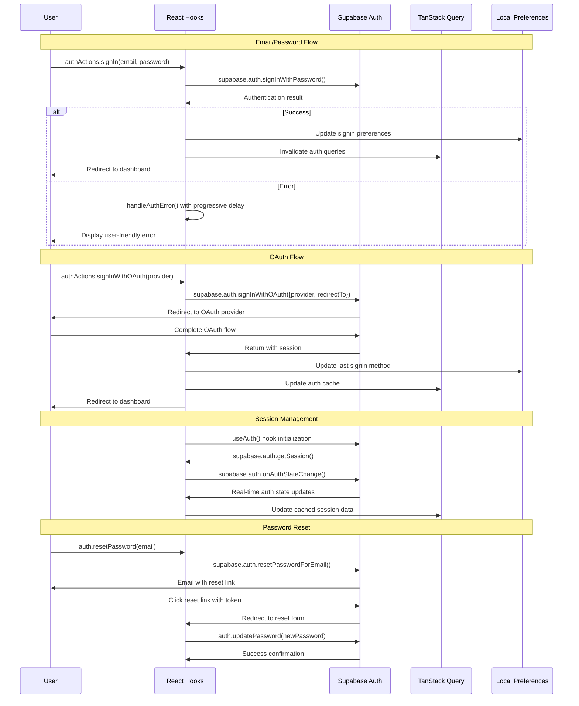

# User Auth Setup Design

## Overview

This design focuses on the core Supabase Auth setup and configuration for Arguschain's authentication infrastructure. The implementation provides a comprehensive, type-safe authentication foundation using Supabase's built-in authentication service with React hooks, TanStack Query integration, and comprehensive error handling. This includes client setup, authentication utilities, and TypeScript integration that serves as the authentication foundation for all features including the signin-page and account management.

## Architecture

### Auth Setup Architecture

```mermaid
graph TB
    subgraph "lib/auth Module Structure"
        A[auth.ts] --> B[Supabase Client & Auth Methods]
        C[auth-hooks.ts] --> D[React Auth Hooks]
        E[queries.ts] --> F[TanStack Query Integration]
        G[types.ts] --> H[TypeScript Interfaces]
        I[error-handler.ts] --> J[Error Handling & Validation]
        K[signin-preferences.ts] --> L[User Preferences Storage]
        M[index.ts] --> N[Barrel Exports]
    end

    subgraph "Supabase Auth Service"
        B --> O[signInWithPassword]
        B --> P[signInWithOAuth]
        B --> Q[signUp]
        B --> R[resetPasswordForEmail]
        B --> S[updateUser]
        B --> T[onAuthStateChange]
        B --> U[Session Management]
    end

    subgraph "OAuth Providers"
        P --> V[GitHub OAuth]
        P --> W[Google OAuth]
        P --> X[Discord OAuth]
    end

    subgraph "React Integration"
        D --> Y[useAuth Hook]
        D --> Z[useUser Hook]
        D --> AA[useSession Hook]
        D --> BB[useAuthActions Hook]
        D --> CC[useUserProfile Hook]
    end

    subgraph "TanStack Query Layer"
        F --> DD[useAuthSession]
        F --> EE[useSignIn/useSignUp]
        F --> FF[usePasswordReset]
        F --> GG[useEmailVerification]
        F --> HH[Cache Management]
    end

    subgraph "Error Handling & Validation"
        J --> II[handleAuthError]
        J --> JJ[RateLimiter]
        J --> KK[Validation Utils]
        J --> LL[Progressive Delays]
    end
```



### Authentication Flow with Supabase Auth



## Components and Interfaces

### Supabase Auth Configuration

#### 1. Supabase Client Setup

```typescript
// lib/auth/auth.ts
import { createClient } from "@supabase/supabase-js";

const supabaseUrl = import.meta.env.VITE_SUPABASE_URL;
const supabaseAnonKey = import.meta.env.VITE_SUPABASE_ANON_KEY;

// Validate environment variables
if (!supabaseUrl || !supabaseAnonKey) {
  throw new Error(
    "Missing Supabase configuration. Please check VITE_SUPABASE_URL and VITE_SUPABASE_ANON_KEY environment variables."
  );
}

// Create Supabase client with auth configuration
export const supabase = createClient(supabaseUrl, supabaseAnonKey, {
  auth: {
    autoRefreshToken: true,
    persistSession: true,
    detectSessionInUrl: true,
    flowType: "pkce", // Use PKCE flow for better security
  },
});

// Auth helper functions
export const auth = {
  signUp: async (email: string, password: string, options?: { data?: any }) => {
    return await supabase.auth.signUp({
      email,
      password,
      options,
    });
  },

  signIn: async (email: string, password: string) => {
    return await supabase.auth.signInWithPassword({
      email,
      password,
    });
  },

  signInWithOAuth: async (provider: "github" | "google" | "discord") => {
    const redirectTo = `${window.location.origin}/auth/callback`;
    return await supabase.auth.signInWithOAuth({
      provider,
      options: {
        redirectTo,
      },
    });
  },

  signOut: async () => {
    return await supabase.auth.signOut();
  },

  getSession: async () => {
    return await supabase.auth.getSession();
  },

  getUser: async () => {
    return await supabase.auth.getUser();
  },

  resetPassword: async (email: string) => {
    const redirectTo = `${window.location.origin}/auth/reset-password`;
    return await supabase.auth.resetPasswordForEmail(email, {
      redirectTo,
    });
  },

  updatePassword: async (password: string) => {
    return await supabase.auth.updateUser({ password });
  },

  updateUser: async (attributes: {
    email?: string;
    password?: string;
    data?: Record<string, any>;
  }) => {
    return await supabase.auth.updateUser(attributes);
  },

  onAuthStateChange: (callback: (event: string, session: any) => void) => {
    return supabase.auth.onAuthStateChange(callback);
  },

  verifyOtp: async (params: {
    email: string;
    token: string;
    type: "signup" | "recovery" | "email_change";
  }) => {
    return await supabase.auth.verifyOtp(params);
  },

  resend: async (email: string, type: "signup" | "email_change") => {
    return await supabase.auth.resend({
      type,
      email,
    });
  },
};

// Export types
export type User = {
  id: string;
  email?: string;
  user_metadata?: {
    name?: string;
    avatar_url?: string;
    full_name?: string;
    [key: string]: any;
  };
  app_metadata?: {
    provider?: string;
    providers?: string[];
    [key: string]: any;
  };
  created_at?: string;
  updated_at?: string;
  email_confirmed_at?: string;
  last_sign_in_at?: string;
};

export type Session = {
  access_token: string;
  refresh_token: string;
  expires_in: number;
  expires_at?: number;
  token_type: string;
  user: User;
};

export type AuthError = {
  message: string;
  status?: number;
};

export const AUTH_CONFIG = {
  redirectUrls: {
    signIn: "/",
    signUp: "/welcome",
    resetPassword: "/auth/reset-password",
    callback: "/auth/callback",
  },
  session: {
    persistSession: true,
    autoRefreshToken: true,
  },
  providers: ["github", "google", "discord"] as const,
} as const;
```

#### 2. React Hooks Integration

```typescript
// lib/auth/auth-hooks.ts
import { useState, useEffect, useCallback } from "react";
import {
  supabase,
  auth,
  type User,
  type Session,
  type AuthError,
} from "./auth";

interface AuthState {
  user: User | null;
  session: Session | null;
  loading: boolean;
  error: AuthError | null;
}

export function useAuth() {
  const [state, setState] = useState<AuthState>({
    user: null,
    session: null,
    loading: true,
    error: null,
  });

  useEffect(() => {
    // Get initial session
    supabase.auth.getSession().then(({ data: { session }, error }) => {
      setState((prev) => ({
        ...prev,
        session,
        user: session?.user ?? null,
        loading: false,
        error: error as AuthError | null,
      }));
    });

    // Listen for auth changes
    const {
      data: { subscription },
    } = supabase.auth.onAuthStateChange((_event, session) => {
      setState((prev) => ({
        ...prev,
        session,
        user: session?.user ?? null,
        loading: false,
        error: null,
      }));
    });

    return () => subscription.unsubscribe();
  }, []);

  const signOut = useCallback(async () => {
    const { error } = await auth.signOut();
    if (error) {
      setState((prev) => ({ ...prev, error: error as AuthError }));
    }
    return { error };
  }, []);

  const clearError = useCallback(() => {
    setState((prev) => ({ ...prev, error: null }));
  }, []);

  return {
    ...state,
    isAuthenticated: !!state.session,
    isLoading: state.loading,
    signOut,
    clearError,
  };
}

export function useUser() {
  const { user, loading, error } = useAuth();
  return { user, loading, error };
}

export function useSession() {
  const { session, loading, error } = useAuth();
  return { session, loading, error };
}

export function useAuthActions() {
  const [loading, setLoading] = useState(false);
  const [error, setError] = useState<AuthError | null>(null);

  const signIn = useCallback(async (email: string, password: string) => {
    setLoading(true);
    setError(null);
    const result = await auth.signIn(email, password);
    setLoading(false);
    if (result.error) {
      setError(result.error as AuthError);
    }
    return result;
  }, []);

  const signUp = useCallback(
    async (email: string, password: string, options?: { data?: any }) => {
      setLoading(true);
      setError(null);
      const result = await auth.signUp(email, password, options);
      setLoading(false);
      if (result.error) {
        setError(result.error as AuthError);
      }
      return result;
    },
    []
  );

  const signInWithOAuth = useCallback(
    async (provider: "github" | "google" | "discord") => {
      setLoading(true);
      setError(null);
      const result = await auth.signInWithOAuth(provider);
      setLoading(false);
      if (result.error) {
        setError(result.error as AuthError);
      }
      return result;
    },
    []
  );

  const resetPassword = useCallback(async (email: string) => {
    setLoading(true);
    setError(null);
    const result = await auth.resetPassword(email);
    setLoading(false);
    if (result.error) {
      setError(result.error as AuthError);
    }
    return result;
  }, []);

  const updatePassword = useCallback(async (password: string) => {
    setLoading(true);
    setError(null);
    const result = await auth.updatePassword(password);
    setLoading(false);
    if (result.error) {
      setError(result.error as AuthError);
    }
    return result;
  }, []);

  const clearError = useCallback(() => {
    setError(null);
  }, []);

  return {
    signIn,
    signUp,
    signInWithOAuth,
    resetPassword,
    updatePassword,
    loading,
    error,
    clearError,
  };
}

export function useUserProfile() {
  const { user, loading, error } = useAuth();
  const { updatePassword } = useAuthActions();

  const updateProfile = useCallback(
    async (updates: {
      email?: string;
      password?: string;
      data?: Record<string, any>;
    }) => {
      return await auth.updateUser(updates);
    },
    []
  );

  return {
    user,
    updateProfile,
    updatePassword,
    loading,
    error,
    clearError: () => {},
  };
}
```

### Core Components

#### 1. Authentication Provider Integration

```typescript
// components/auth/AuthProvider.tsx
import { ReactNode } from "react";
import { authClient } from "@/lib/auth/auth-client";

interface AuthProviderProps {
  children: ReactNode;
}

export function AuthProvider({ children }: AuthProviderProps) {
  // Better Auth handles the provider logic internally
  // We just need to wrap our app with the auth client context
  return <>{children}</>;
}
```

#### 2. Login Form Component

```typescript
// components/auth/LoginForm.tsx
import { useState } from "react";
import { useNavigate } from "react-router-dom";
import { signIn } from "@/lib/auth/auth-client";
import { Button } from "@/components/global";
import { Input } from "@/components/global";
import { Label } from "@/components/global";

export function LoginForm() {
  const [email, setEmail] = useState("");
  const [password, setPassword] = useState("");
  const [loading, setLoading] = useState(false);
  const [error, setError] = useState("");
  const navigate = useNavigate();

  const handleSubmit = async (e: React.FormEvent) => {
    e.preventDefault();
    setLoading(true);
    setError("");

    try {
      const { data, error } = await signIn.email({
        email,
        password,
      });

      if (error) {
        setError(error.message);
        return;
      }

      navigate("/");
    } catch (err) {
      setError(err instanceof Error ? err.message : "Login failed");
    } finally {
      setLoading(false);
    }
  };

  return (
    <form onSubmit={handleSubmit} className="space-y-4">
      <div>
        <Label htmlFor="email">Email</Label>
        <Input
          id="email"
          type="email"
          value={email}
          onChange={(e) => setEmail(e.target.value)}
          required
        />
      </div>
      <div>
        <Label htmlFor="password">Password</Label>
        <Input
          id="password"
          type="password"
          value={password}
          onChange={(e) => setPassword(e.target.value)}
          required
        />
      </div>
      {error && (
        <div className="text-red-500 text-sm">{error}</div>
      )}
      <Button type="submit" disabled={loading} className="w-full">
        {loading ? "Signing in..." : "Sign In"}
      </Button>
    </form>
  );
}
```

#### 3. OAuth Button Component

```typescript
// components/auth/OAuthButtons.tsx
import { signIn } from "@/lib/auth/auth-client";
import { Button } from "@/components/global";
import { Github } from "lucide-react";

export function OAuthButtons() {
  const handleGitHubSignIn = async () => {
    try {
      await signIn.social({
        provider: "github",
        callbackURL: "/",
      });
    } catch (error) {
      console.error("GitHub sign in failed:", error);
    }
  };

  return (
    <div className="space-y-3">
      <Button
        type="button"
        variant="outline"
        onClick={handleGitHubSignIn}
        className="w-full"
      >
        <Github className="mr-2 h-4 w-4" />
        Continue with GitHub
      </Button>
    </div>
  );
}
```

#### 4. API Key Management Components

```typescript
// components/auth/ApiKeyManager.tsx
import { useState } from "react";
import { useQuery, useMutation, useQueryClient } from "@tanstack/react-query";
import { authClient } from "@/lib/auth/auth-client";
import { Button } from "@/components/global";
import { Input } from "@/components/global";

interface ApiKey {
  id: string;
  name: string;
  key_prefix: string;
  permissions: Record<string, string[]>;
  rateLimitTier: string;
  expiresAt?: string;
  lastUsedAt?: string;
  createdAt: string;
}

export function ApiKeyManager() {
  const [newKeyName, setNewKeyName] = useState("");
  const queryClient = useQueryClient();

  const { data: apiKeys, isLoading } = useQuery({
    queryKey: ["api-keys"],
    queryFn: async () => {
      const { data } = await authClient.apiKey.list();
      return data;
    },
  });

  const createKeyMutation = useMutation({
    mutationFn: async (name: string) => {
      const { data } = await authClient.apiKey.create({
        name,
        permissions: {
          trace: ["read"],
          logs: ["read"],
          blocks: ["read"],
          transactions: ["read"],
        },
      });
      return data;
    },
    onSuccess: () => {
      queryClient.invalidateQueries({ queryKey: ["api-keys"] });
      setNewKeyName("");
    },
  });

  const deleteKeyMutation = useMutation({
    mutationFn: async (id: string) => {
      await authClient.apiKey.delete({ id });
    },
    onSuccess: () => {
      queryClient.invalidateQueries({ queryKey: ["api-keys"] });
    },
  });

  if (isLoading) return <div>Loading API keys...</div>;

  return (
    <div className="space-y-6">
      <div>
        <h3 className="text-lg font-semibold mb-4">API Keys</h3>
        <div className="flex gap-2">
          <Input
            placeholder="API key name"
            value={newKeyName}
            onChange={(e) => setNewKeyName(e.target.value)}
          />
          <Button
            onClick={() => createKeyMutation.mutate(newKeyName)}
            disabled={!newKeyName || createKeyMutation.isPending}
          >
            Create Key
          </Button>
        </div>
      </div>

      <div className="space-y-3">
        {apiKeys?.map((key: ApiKey) => (
          <div
            key={key.id}
            className="flex items-center justify-between p-4 border rounded-lg"
          >
            <div>
              <div className="font-medium">{key.name}</div>
              <div className="text-sm text-gray-500">
                {key.key_prefix}••••••••
              </div>
              <div className="text-xs text-gray-400">
                Created: {new Date(key.createdAt).toLocaleDateString()}
                {key.lastUsedAt && (
                  <span className="ml-2">
                    Last used: {new Date(key.lastUsedAt).toLocaleDateString()}
                  </span>
                )}
              </div>
            </div>
            <Button
              variant="destructive"
              size="sm"
              onClick={() => deleteKeyMutation.mutate(key.id)}
              disabled={deleteKeyMutation.isPending}
            >
              Delete
            </Button>
          </div>
        ))}
      </div>
    </div>
  );
}
```

#### 5. Protected Route Component

```typescript
// components/auth/ProtectedRoute.tsx
import { useSession } from "@/lib/auth/auth-client";
import { Navigate, useLocation } from "react-router-dom";
import { Loader } from "@/components/global";

interface ProtectedRouteProps {
  children: React.ReactNode;
}

export function ProtectedRoute({ children }: ProtectedRouteProps) {
  const { data: session, isPending } = useSession();
  const location = useLocation();

  if (isPending) {
    return (
      <div className="min-h-screen flex items-center justify-center">
        <Loader />
      </div>
    );
  }

  if (!session) {
    return (
      <Navigate
        to="/signin"
        state={{ from: location }}
        replace
      />
    );
  }

  return <>{children}</>;
}
```

## Data Models

### Database Schema (Supabase + Better Auth)

Better Auth will automatically create the necessary tables in your Supabase database:

```sql
-- Better Auth will create these tables automatically
-- user, session, account, verification tables

-- Additional API key tables for the plugin
CREATE TABLE api_keys (
  id TEXT PRIMARY KEY,
  user_id TEXT NOT NULL REFERENCES auth.users(id) ON DELETE CASCADE,
  name TEXT NOT NULL,
  key_hash TEXT NOT NULL UNIQUE,
  key_prefix TEXT NOT NULL,
  permissions JSONB DEFAULT '{}',
  rate_limit_tier TEXT DEFAULT 'free',
  expires_at TIMESTAMP WITH TIME ZONE,
  last_used_at TIMESTAMP WITH TIME ZONE,
  is_active BOOLEAN DEFAULT true,
  created_at TIMESTAMP WITH TIME ZONE DEFAULT NOW(),
  updated_at TIMESTAMP WITH TIME ZONE DEFAULT NOW()
);

CREATE TABLE api_key_usage (
  id TEXT PRIMARY KEY,
  api_key_id TEXT NOT NULL REFERENCES api_keys(id) ON DELETE CASCADE,
  endpoint TEXT NOT NULL,
  requests_count INTEGER DEFAULT 0,
  error_count INTEGER DEFAULT 0,
  response_time_avg FLOAT DEFAULT 0,
  date DATE NOT NULL,
  created_at TIMESTAMP WITH TIME ZONE DEFAULT NOW(),

  UNIQUE(api_key_id, endpoint, date)
);

-- Indexes for performance
CREATE INDEX idx_api_keys_user_id ON api_keys(user_id);
CREATE INDEX idx_api_keys_hash ON api_keys(key_hash);
CREATE INDEX idx_api_key_usage_key_date ON api_key_usage(api_key_id, date);
```

### TypeScript Types

```typescript
// lib/auth/types.ts
import type { Session, User } from "./auth";

export type AuthUser = User;
export type AuthSession = Session;

export interface ApiKey {
  id: string;
  userId: string;
  name: string;
  keyHash: string;
  keyPrefix: string;
  permissions: Record<string, string[]>;
  rateLimitTier: "free" | "pro" | "enterprise";
  expiresAt?: Date;
  lastUsedAt?: Date;
  isActive: boolean;
  createdAt: Date;
  updatedAt: Date;
}

export interface CreateApiKeyRequest {
  name: string;
  permissions?: Record<string, string[]>;
  rateLimitTier?: "free" | "pro" | "enterprise";
  expiresAt?: Date;
}

export interface ApiKeyUsageStats {
  apiKeyId: string;
  totalRequests: number;
  totalErrors: number;
  avgResponseTime: number;
  dailyUsage: Array<{
    date: string;
    requests: number;
    errors: number;
  }>;
}
```

## Error Handling

### Supabase Error Handling

```typescript
// lib/auth/error-handler.ts
import { useState, useCallback } from "react";

export enum SupabaseErrorCode {
  INVALID_CREDENTIALS = "invalid_credentials",
  EMAIL_NOT_CONFIRMED = "email_not_confirmed",
  TOO_MANY_REQUESTS = "too_many_requests",
  WEAK_PASSWORD = "weak_password",
  EMAIL_ALREADY_EXISTS = "email_already_exists",
  NETWORK_ERROR = "network_error",
  UNKNOWN_ERROR = "unknown_error",
}

export interface AuthErrorResponse {
  message: string;
  code: SupabaseErrorCode;
  field?: string;
}

export function mapSupabaseError(error: any): AuthErrorResponse {
  if (!error) {
    return {
      message: "An unexpected error occurred. Please try again.",
      code: SupabaseErrorCode.UNKNOWN_ERROR,
    };
  }

  const message = error.message || error.error_description || "Unknown error";

  if (message.includes("Invalid login credentials")) {
    return {
      message:
        "Invalid email or password. Please check your credentials and try again.",
      code: SupabaseErrorCode.INVALID_CREDENTIALS,
    };
  }

  if (message.includes("Email not confirmed")) {
    return {
      message:
        "Please check your email and click the verification link before signing in.",
      code: SupabaseErrorCode.EMAIL_NOT_CONFIRMED,
    };
  }

  if (message.includes("Too many requests")) {
    return {
      message:
        "Too many login attempts. Please wait a moment before trying again.",
      code: SupabaseErrorCode.TOO_MANY_REQUESTS,
    };
  }

  if (message.includes("Password should be at least")) {
    return {
      message: "Password must be at least 6 characters long.",
      code: SupabaseErrorCode.WEAK_PASSWORD,
      field: "password",
    };
  }

  if (message.includes("User already registered")) {
    return {
      message:
        "An account with this email already exists. Try signing in instead.",
      code: SupabaseErrorCode.EMAIL_ALREADY_EXISTS,
      field: "email",
    };
  }

  if (message.includes("fetch")) {
    return {
      message: "Network error. Please check your connection and try again.",
      code: SupabaseErrorCode.NETWORK_ERROR,
    };
  }

  return {
    message: message || "An unexpected error occurred. Please try again.",
    code: SupabaseErrorCode.UNKNOWN_ERROR,
  };
}

export function handleAuthError(error: unknown): AuthErrorResponse {
  return mapSupabaseError(error);
}

// Rate limiting utility
export class RateLimiter {
  private attempts: Map<string, { count: number; resetTime: number }> =
    new Map();

  constructor(
    private maxAttempts: number = 5,
    private windowMs: number = 15 * 60 * 1000 // 15 minutes
  ) {}

  isAllowed(key: string): boolean {
    const now = Date.now();
    const attempt = this.attempts.get(key);

    if (!attempt || now > attempt.resetTime) {
      return true;
    }

    return attempt.count < this.maxAttempts;
  }

  recordAttempt(key: string): void {
    const now = Date.now();
    const attempt = this.attempts.get(key);

    if (!attempt || now > attempt.resetTime) {
      this.attempts.set(key, {
        count: 1,
        resetTime: now + this.windowMs,
      });
    } else {
      attempt.count++;
    }
  }

  getRemainingAttempts(key: string): number {
    const attempt = this.attempts.get(key);
    if (!attempt || Date.now() > attempt.resetTime) {
      return this.maxAttempts;
    }
    return Math.max(0, this.maxAttempts - attempt.count);
  }

  getTimeUntilReset(key: string): number {
    const attempt = this.attempts.get(key);
    if (!attempt) return 0;
    return Math.max(0, attempt.resetTime - Date.now());
  }
}

// Progressive delay utility
export function getProgressiveDelay(attemptCount: number): number {
  return Math.min(1000 * Math.pow(2, attemptCount - 1), 8000);
}

export function delay(ms: number): Promise<void> {
  return new Promise((resolve) => setTimeout(resolve, ms));
}

// Global rate limiter instance
export const authRateLimiter = new RateLimiter();

// Custom hook for error handling
export function useAuthError() {
  const [error, setError] = useState<string | null>(null);

  const handleError = useCallback((err: unknown) => {
    const errorResponse = handleAuthError(err);
    setError(errorResponse.message);

    // Auto-clear error after 5 seconds
    setTimeout(() => setError(null), 5000);
  }, []);

  const clearError = useCallback(() => setError(null), []);

  return { error, handleError, clearError };
}

// Validation utilities
export const validation = {
  email: (email: string): { isValid: boolean; error?: string } => {
    const emailRegex = /^[^\s@]+@[^\s@]+\.[^\s@]+$/;
    if (!email) {
      return { isValid: false, error: "Email is required" };
    }
    if (!emailRegex.test(email)) {
      return { isValid: false, error: "Please enter a valid email address" };
    }
    return { isValid: true };
  },

  password: (password: string): { isValid: boolean; error?: string } => {
    if (!password) {
      return { isValid: false, error: "Password is required" };
    }
    if (password.length < 6) {
      return {
        isValid: false,
        error: "Password must be at least 6 characters long",
      };
    }
    return { isValid: true };
  },

  name: (name: string): { isValid: boolean; error?: string } => {
    if (!name) {
      return { isValid: false, error: "Name is required" };
    }
    if (name.length < 2) {
      return {
        isValid: false,
        error: "Name must be at least 2 characters long",
      };
    }
    return { isValid: true };
  },

  username: (username: string): { isValid: boolean; error?: string } => {
    if (!username) {
      return { isValid: false, error: "Username is required" };
    }
    if (username.length < 3) {
      return {
        isValid: false,
        error: "Username must be at least 3 characters long",
      };
    }
    if (!/^[a-zA-Z0-9_-]+$/.test(username)) {
      return {
        isValid: false,
        error:
          "Username can only contain letters, numbers, underscores, and hyphens",
      };
    }
    return { isValid: true };
  },

  confirmPassword: (
    password: string,
    confirmPassword: string
  ): { isValid: boolean; error?: string } => {
    if (!confirmPassword) {
      return { isValid: false, error: "Please confirm your password" };
    }
    if (password !== confirmPassword) {
      return { isValid: false, error: "Passwords do not match" };
    }
    return { isValid: true };
  },
};
```

## Testing Strategy

### Unit Tests with Better Auth

```typescript
// __tests__/auth/auth-client.test.ts
import { describe, it, expect, vi } from "vitest";
import { authClient } from "@/lib/auth/auth-client";

// Mock Better Auth client
vi.mock("better-auth/react", () => ({
  createAuthClient: vi.fn(() => ({
    signIn: {
      email: vi.fn(),
      social: vi.fn(),
    },
    signUp: {
      email: vi.fn(),
    },
    signOut: vi.fn(),
    useSession: vi.fn(),
  })),
}));

describe("Auth Client", () => {
  it("should create auth client with correct config", () => {
    expect(authClient).toBeDefined();
    expect(authClient.signIn).toBeDefined();
    expect(authClient.signUp).toBeDefined();
  });

  it("should handle email sign in", async () => {
    const mockSignIn = vi.fn().mockResolvedValue({
      data: { user: { id: "1", email: "test@example.com" } },
      error: null,
    });
    authClient.signIn.email = mockSignIn;

    const result = await authClient.signIn.email({
      email: "test@example.com",
      password: "password123",
    });

    expect(mockSignIn).toHaveBeenCalledWith({
      email: "test@example.com",
      password: "password123",
    });
    expect(result.data).toBeDefined();
  });
});
```

### Integration Tests

```typescript
// __tests__/auth/AuthFlow.test.tsx
import { render, screen, fireEvent, waitFor } from "@testing-library/react";
import { BrowserRouter } from "react-router-dom";
import { QueryClient, QueryClientProvider } from "@tanstack/react-query";
import { LoginForm } from "@/components/auth/LoginForm";

const TestWrapper = ({ children }: { children: React.ReactNode }) => {
  const queryClient = new QueryClient({
    defaultOptions: { queries: { retry: false } },
  });

  return (
    <QueryClientProvider client={queryClient}>
      <BrowserRouter>
        {children}
      </BrowserRouter>
    </QueryClientProvider>
  );
};

describe("Authentication Flow", () => {
  it("should render login form and handle submission", async () => {
    render(<LoginForm />, { wrapper: TestWrapper });

    const emailInput = screen.getByLabelText("Email");
    const passwordInput = screen.getByLabelText("Password");
    const submitButton = screen.getByRole("button", { name: /sign in/i });

    fireEvent.change(emailInput, { target: { value: "test@example.com" } });
    fireEvent.change(passwordInput, { target: { value: "password123" } });
    fireEvent.click(submitButton);

    await waitFor(() => {
      expect(submitButton).toHaveTextContent("Signing in...");
    });
  });
});
```

## Security Considerations

### Better Auth Security Features

Better Auth provides built-in security features:

- **CSRF Protection**: Automatic CSRF token handling
- **Session Security**: Secure session management with rotation
- **Rate Limiting**: Built-in rate limiting for authentication endpoints
- **Password Security**: Secure password hashing with bcrypt
- **Email Verification**: Built-in email verification flow
- **OAuth Security**: Secure OAuth implementation with state validation

### Additional Security Measures

```typescript
// lib/auth/security.ts
export const securityConfig = {
  // API Key security
  apiKey: {
    length: 32,
    prefix: "ak_",
    hashAlgorithm: "sha256",
    rateLimits: {
      free: { requests: 1000, window: "1h" },
      pro: { requests: 10000, window: "1h" },
      enterprise: { requests: 100000, window: "1h" },
    },
  },

  // Session security
  session: {
    httpOnly: true,
    secure: process.env.NODE_ENV === "production",
    sameSite: "strict" as const,
    maxAge: 7 * 24 * 60 * 60, // 7 days
  },

  // Password requirements
  password: {
    minLength: 8,
    requireUppercase: true,
    requireLowercase: true,
    requireNumbers: true,
    requireSpecialChars: false,
  },
};

// API Key validation middleware
export function validateApiKey(key: string): boolean {
  return key.startsWith("ak_") && key.length === 35; // ak_ + 32 chars
}

// Rate limiting for API keys
export function checkRateLimit(
  apiKey: string,
  tier: "free" | "pro" | "enterprise"
): boolean {
  const limits = securityConfig.apiKey.rateLimits[tier];
  // Implementation would check against usage tracking
  return true; // Placeholder
}
```

## Integration with Existing Architecture

### Router Integration

Update your existing `App.tsx` to include authentication routes:

```typescript
// App.tsx additions
import { ProtectedRoute } from "@/components/auth/ProtectedRoute";
import { LoginForm } from "@/components/auth/LoginForm";

// Wrap protected routes
<Route
  path="/"
  element={
    <ProtectedRoute>
      <RouteTransition>
        <Dashboard />
      </RouteTransition>
    </ProtectedRoute>
  }
/>

// Update existing SignIn route
<Route
  path="/signin"
  element={
    <RouteTransition>
      <LoginForm />
    </RouteTransition>
  }
/>
```

### TanStack Query Integration

```typescript
// lib/auth/queries.ts
import { useQuery, useMutation, useQueryClient } from "@tanstack/react-query";
import { authClient } from "./auth-client";

export function useAuthSession() {
  return useQuery({
    queryKey: ["auth-session"],
    queryFn: async () => {
      const { data } = await authClient.getSession();
      return data;
    },
    staleTime: 5 * 60 * 1000, // 5 minutes
    refetchOnWindowFocus: false,
  });
}

export function useSignOut() {
  const queryClient = useQueryClient();

  return useMutation({
    mutationFn: () => authClient.signOut(),
    onSuccess: () => {
      queryClient.clear();
      window.location.href = "/signin";
    },
  });
}
```

This design leverages Better Auth's comprehensive features while integrating seamlessly with your existing Arguschain architecture, Supabase database, and React/TypeScript stack.
